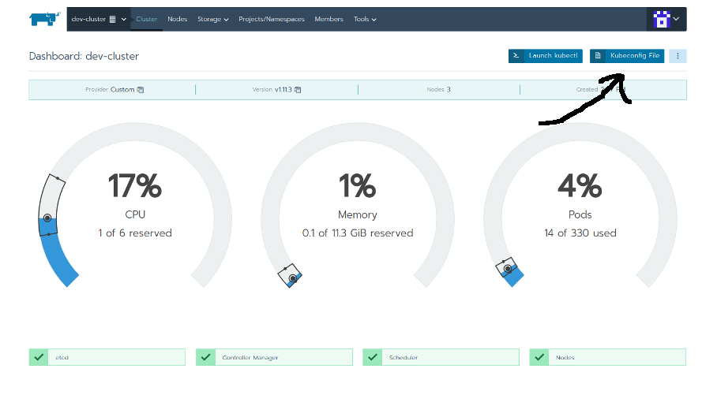

## Deploying Kubernetes on bare metal with Rancher 2.0


### Install Rancher

Create a VM with Docker and Docker Compose installed and install Rancher 2.0 with docker compose:

+ Download this file to a VM:
 [docker-compose.yaml](https://github.com/polinchw/rancher-docker-compose/blob/master/docker-compose.yaml)

+ Run this command:
    +  ```docker-compose up -d```

### Create your Kubernetes cluster with Rancher

Install a custom Kubernetes cluster with Rancher.

### Create VMs for Kubernetes and join the Kubernetes cluster

Run the following commands on all the VMs that your Kubernetes cluster will run on.  The final docker command
will have the VM join the new Kubernetes cluster.

Replace the **--server** and **--token** with your Rancher server and cluster token.

```
#!/bin/bash

sudo apt update
sudo apt -y dist-upgrade
sudo apt -y install docker.io
#This is only needed if you are using Ubuntu, if you are using Debian 9 then you don't need the linux-image-extra
sudo apt -y install linux-image-extra-$(uname -r)
#This is dependent on your Rancher server
sudo docker run -d --privileged --restart=unless-stopped --net=host -v /etc/kubernetes:/etc/kubernetes -v /var/run:/var/run rancher/rancher-agent:v2.1.0-rc9 --server https://75.77.159.159 --token rb8k8kkqw55jqnqbbf4ssdjqtw6hndhfxxcghgv8257kx4p6qsqq55 --ca-checksum 641b2888ce3f1091d20149a495d10457154428f440475b42291b6af1b6c0dd06 --etcd --controlplane --worker
```

### Download the kub config file for the cluster



After you download the kub config file you can use it by running this command:

```
export KUBECONFIG=$HOME/.kube/rancher-config
```

### Install Helm on the cluster

```
git clone https://github.com/polinchw/set-up-tiller

cd set-up-tiller

chmod u+x set-up-tiller.sh

./set-up-tiller.sh

helm init --service-account tiller

```

### Install StorageOS storage class

Install StorageOS as a daemonset with CSI and RBAC support.  Make sure your
kubectl context is pointing to the new Kubernete's cluster context.

```
git clone https://github.com/storageos/deploy.git storageos

cd storageos/k8s/deploy-storageos/CSI

./deploy-storageos.sh
```

### Set StorageOS as the default storage class

kubectl patch storageclass fast -p '{"metadata": {"annotations":{"storageclass.kubernetes.io/is-default-class":"true"}}}'

### Using the default Nginx Igress

Rancher automatically install the nginx ingress controller on all the nodes in the cluster.  
If you are able to expose one of the VMs in the cluster to the outside world with a public IP
then you can connect to the ingress based services on ports 80 and 443.

Any app you want to be accessible through the default nginx ingress must be added to the 'default'
project in Rancher.

